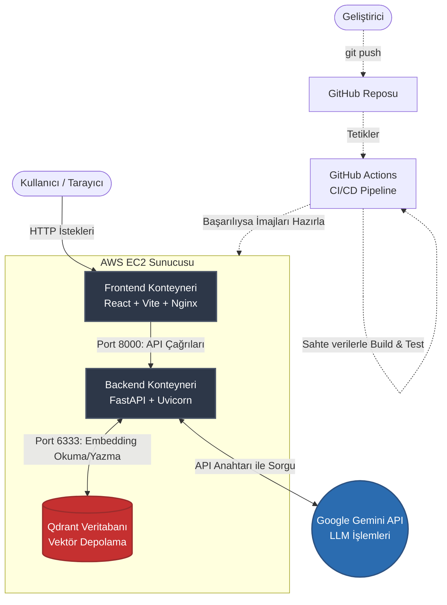

# Modular RAG Engine: Enterprise-Grade Document Intelligence

[](https://www.docker.com/)
[](https://fastapi.tiangolo.com/)
[](https://reactjs.org/)
[](https://qdrant.tech/)
[](http://35.157.208.84/)

Bu proje, PDF belgelerini yükleyip içeriği hakkında yapay zeka ile etkileşimli sohbet etmenizi sağlayan, uçtan uca (E2E) tasarlanmış, konteynerize edilmiş ve bulut ortamında çalışan kurumsal seviye bir RAG (Retrieval-Augmented Generation) sistemidir.

🔗 **Canlı Demo (AWS):** [http://35.157.208.84/](http://35.157.208.84/) *(Not: AWS sunucusu kapatılmış olabilir)*

## 📐 Sistem Mimarisi ve Akış Diyagramı

Aşağıdaki diyagram, uygulamanın istemci, sunucu, veritabanı ve CI/CD süreçleri arasındaki veri akışını göstermektedir.



## Temel Özellikler (Core Features)

- **Streaming (Akışlı Yanıt):** Tıpkı ChatGPT'de olduğu gibi, LLM'den gelen cevaplar saniyelerce beklenmek yerine kelime kelime (stream) ekrana yazdırılarak akıcı ve gerçek zamanlı bir kullanıcı deneyimi sunulur.
- **Doküman Bazlı Filtreleme (Doc-Filtering):** Birden fazla PDF yüklendiğinde, sistem vektör aramasını belirli bir doküman özelinde filtreleyerek cevapların karışmasını engeller ve yüksek doğruluk sağlar.
- **Bağlama Sadakat ve Hassas Yorumlama:** Sistem, dış dünya bilgisinden (halüsinasyondan) ziyade **kesinlikle yüklenen PDF içeriğine sadık kalacak** şekilde kurgulanmıştır. Kendi kendine bilgi uydurmaz, ancak sağlanan metnin sınırları içerisinde profesyonelce yorum ve analiz yapabilir.
- **Anlamsal Arama (Semantic Search):** Klasik kelime eşleştirme yerine, cümlelerin bağlamını ve anlamsal bütünlüğünü anlayarak doküman içinde arama yapar.
- **Hafıza (Chat History):** Önceki soruları ve cevapları bağlam olarak tutarak tutarlı bir sohbet (multi-turn) deneyimi sunar.
- **İzole Mimari & Güvenlik:** Frontend ve Backend tamamen bağımsız konteynerlerde çalışır. API anahtarları `.env` üzerinden izole edilir.

## Kullanılan Teknolojiler (Tech Stack)

### 1. Model ve Veri İşleme (AI/MLOps)
* **LLM Engine:** Google Gemini Pro API
* **Vektör Veritabanı:** Qdrant
* **Belge İşleme:** PyMuPDF

### 2. Backend (Sunucu)
* **Framework:** FastAPI (Asenkron) & Uvicorn
* **Mimari:** Modüler, RESTful API tasarımı

### 3. Frontend (İstemci)
* **Kütüphane:** React.js (Vite kullanılarak optimize edilmiştir)
* **Stilleme:** Tailwind CSS
* **Sunum:** Nginx (Multi-stage build ile statik sunum)

### 4. DevOps ve Dağıtım (Deployment)
* **Konteynerleştirme:** Docker & Docker Compose
* **Sürekli Entegrasyon (CI):** GitHub Actions
* **Bulut Altyapısı:** AWS EC2 (Ubuntu Server 22.04 LTS)

## Yerel Kurulum (Local Development)

Projeyi kendi bilgisayarınızda çalıştırmak için:

1. Repoyu klonlayın:
   ```bash
   git clone [https://github.com/znrdpt0/Modular-RAG-Engine.git](https://github.com/znrdpt0/Modular-RAG-Engine.git)
   cd Modular-RAG-Engine
   ```

2. Ana dizinde bir `.env` dosyası oluşturun ve yapılandırın:
   ```env
   GEMINI_API_KEY=sizin_gercek_api_anahtariniz
   QDRANT_URL=http://qdrant:6333
   CHUNK_SIZE=500
   CHUNK_OVERLAP=100
   ```

3. Docker motorlarını ateşleyin:
   ```bash
   docker compose up --build -d
   ```

4. Uygulamaya erişin:
   * **Frontend Arayüzü:** `http://localhost`
   * **Backend Swagger Docs:** `http://localhost:8000/docs`

---
👨‍💻 **Geliştirici:** Zınar Demirpoalt | 4. Sınıf Bilgisayar Mühendisliği Öğrencisi, Aydın Adnan Menderes Üniversitesi  
📧 **İletişim:** [LinkedIn Profilim](https://linkedin.com/in/znr-dpt) | [GitHub Profilim](https://github.com/znrdpt0)
